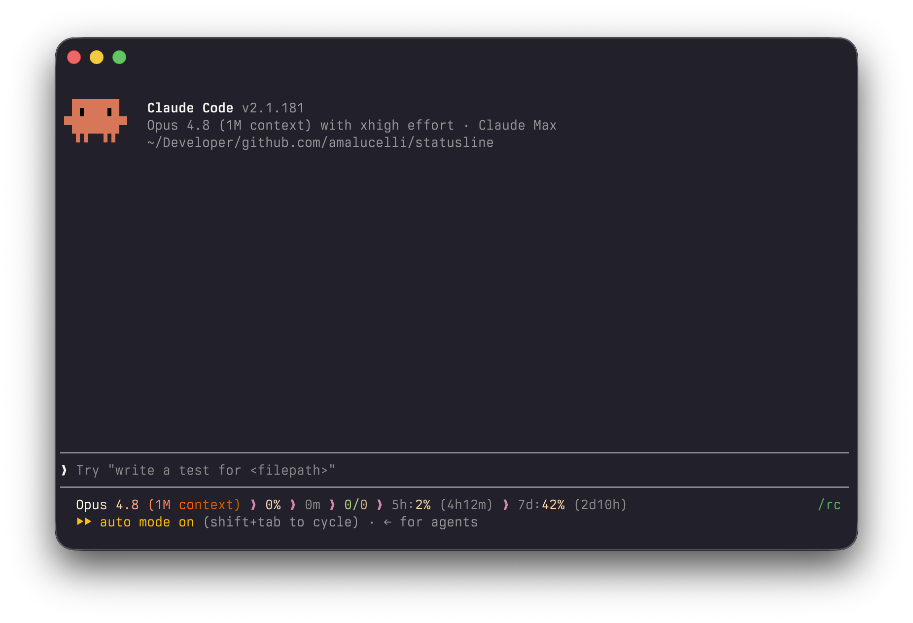

# statusline

My status line for Claude Code.



This is my personal status line for Claude Code, built for my own setup. I'm not accepting issues, suggestions, or pull requests, feel free to fork it and customize it for your own needs.

It shows:

- Model name — `Opus 4.8 (1M context)`
- Context usage — `9%`
- Session duration — `0m`
- Input / output tokens — `92k/182`
- 5-hour usage limit and reset countdown — `5h:2% (4h17m)`
- 7-day usage limit and reset countdown — `7d:42% (2d10h)`

## Install

```sh
brew install --cask amalucelli/tap/statusline
```

Or from source:

```sh
cargo install --path . --root ~/.local
```

Then point Claude Code at it in `settings.json`, using the path `which statusline` prints:

```json
"statusLine": {
  "type": "command",
  "command": "/opt/homebrew/bin/statusline",
  "padding": 0
}
```

## Usage

Claude Code runs the binary with no arguments, pipes it the session JSON on stdin, and renders the single line it writes to stdout. Flags:

```sh
statusline --help     # flags and description
statusline -v         # print the version
```
